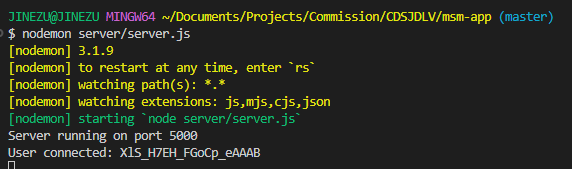

# Colegio de San Juan de Letran Vehicles

### This website is equipped with orange-pi for data gathering and api(not updated yet) for data storage

# Set Up

1. Clone or Download the repository
2. Extract the files 
3. Open Visual Studio Code
4. Select the folder "CDSJDLV"

## Now we are going to use terminal, follow these steps accordingly 

#### Running the server first, (at this time server serve as an experimental since we don't have the api to begin with)

1. ctrl + j
2. type "cd msm-app"

3. Run the server.js "nodemon server/server.js"

### Running the web app
1. create new terminal "ctrl + shift + ,"
2. type "cd msm-app" (like what you did earlier to the server)
3. Run the web app "npm run dev"

4. ctrl + click the link "http://localhost:5173" or type localhost:5173 on your browser

