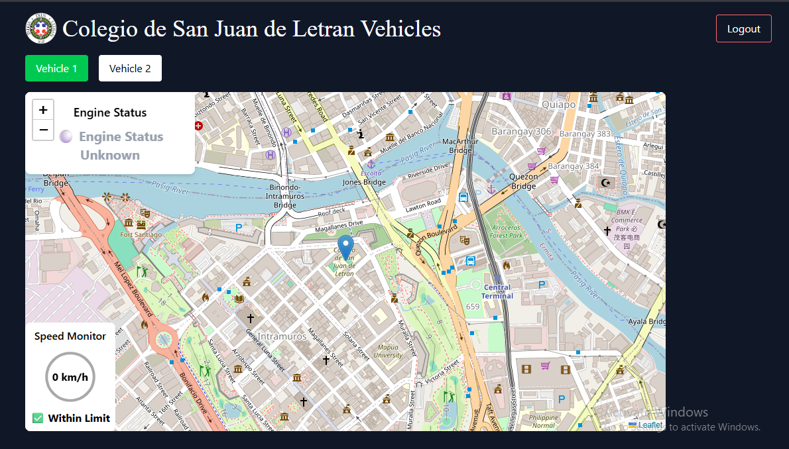

# Colegio de San Juan de Letran Vehicles



### This website is equipped sinotrack for gathering data and accessible using flespi via api

# Download & Extraction

1. Install Node.Js (If not done yet)
    * ```bash
            https://nodejs.org/en
        ```
2. Clone or Download the repository
3. Extract the files
4. Once extracted find the root folder then drag it outside
    * CDSJDLV-master > CDSJDLV-master(drag this one out)
5. Open Visual Studio Code
6. Select the folder "CDSJDLV-master" the folder you drag outside


# Set Up
1. Running the server
    * ctrl + j
    * install nodemon
        ```bash
            npm i -g nodemon
        ```
    * Install all dependencies
        ```bash
            npm install
        ```
    * Run the server.js
        ```bash
            nodemon server/server.js
        ``` 
2. Running the web app
    * create new terminal 
        ```bash 
            ctrl + shift + ,
        ```
    * Run the web app
        ```bash
            npm run dev
        ```
    * ctrl + click the link or type this on your browser
        ```bash
            http://localhost:5173
        ```

# Note
1. Make sure you installed Node.Js
2. if npm is error you must first bypass your system using poweshell
    * search powershell in your laptop then type this
        ```bash
            Set-ExecutionPolicy -Scope CurrentUser -ExecutionPolicy RemoteSigned
        ```
