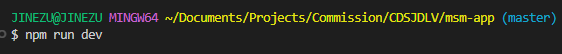

# Colegio de San Juan de Letran Vehicles


### This website is equipped with orange-pi for data gathering and api(not updated yet) for data storage

# Download & Extraction

1. Clone or Download the repository
2. Extract the files 
3. Open Visual Studio Code
4. Select the folder "CDSJDLV"
5. Install Node.Js 


# Set Up

1. ctrl + j
2. Install all dependencies first
```bash
npm install
```
3. Go to msm-app folder
```bash
cd msm-app
```
4. Run the server.js 
```bash
nodemon server/server.js
``` 

#### Running the web app
1. create new terminal "ctrl + shift + ,"
2. type "cd msm-app" (like what you did earlier to the server)
3. Run the web app "npm run dev"



4. ctrl + click the link "http://localhost:5173" or type localhost:5173 on your browser


